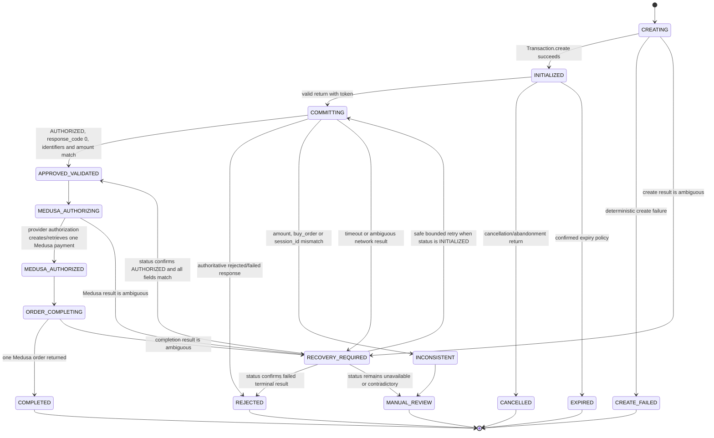

# Webpay Plus architecture

## Status and scope

This document defines the proposed Webpay Plus integration for Indiscreta before
any payment code or dependency is added. It targets the versions currently
installed in this repository:

- Medusa `2.18.0`
- `@medusajs/js-sdk` `2.18.0`
- Next.js `15.5.21`
- Node.js `>=20`
- Chile region and CLP currency

This is a design artifact for integration review. It does not authorize a
production rollout, the installation of `transbank-sdk`, or the use of real
credentials.

Webpay must be implemented as a Medusa Payment Module Provider. Medusa remains
the owner of carts, payment collections, payment sessions, payments, and
orders. The Webpay integration must not create a parallel order system.

## Sources of truth

The implementation must be checked again against the exact SDK version selected
at installation time. The current design is based on:

- [Medusa Payment Module Provider](https://docs.medusajs.com/resources/commerce-modules/payment/payment-provider)
- [Medusa payment flow](https://docs.medusajs.com/resources/commerce-modules/payment/payment-flow)
- [Medusa custom payment provider guide](https://docs.medusajs.com/resources/references/payment/provider)
- [Transbank Webpay Plus Node.js reference](https://proyecto-ejemplo-node.transbankdevelopers.cl/api-reference/webpay-plus)
- [Official Transbank Node.js SDK](https://github.com/TransbankDevelopers/transbank-sdk-nodejs)

Transbank documents `buy_order` with a maximum length of 26 characters and
`session_id` with a maximum length of 61 characters. For CLP, the amount sent to
Transbank is an integer. The integration must use the server-calculated Medusa
cart total without multiplying or dividing it by 100.

## Architectural decision

### Payment Module Provider

Create a local Payment Module Provider with a stable identifier such as
`webpay-plus` and register it in the Payment Module. Assuming the configured
provider instance ID is `webpay`, the resulting Medusa provider ID is expected
to be `pp_webpay-plus_webpay`; the exact generated ID must be verified against
Medusa 2.18.0 when the provider is first loaded.

The provider remains the Medusa payment-contract adapter and implements every
method required by `AbstractPaymentProvider` in the installed Medusa version.
It is not the exclusive owner of initial orchestration. A proprietary backend
workflow owns Webpay initiation and calls `Transaction.create()` only after it
has resolved and durably correlated the Medusa resources described below.
Later stages keep `Transaction.commit()`, `Transaction.status()`, and any future
refund operation in backend-only orchestration. Credentials and SDK objects
exist only in the backend.

This split is required by the verified Medusa `2.18.0` contract. The provider's
`InitiatePaymentInput` exposes the server-side amount, currency, validated
context, and provider data, but it does not explicitly contain all internal
cart and payment-collection relations needed by the durable idempotency
boundary. Medusa documents this context/data as validated and not directly
delivered by the user; it is not treated as client-controlled. It is still
insufficient as the only correlation source because the required internal
relationships are neither complete nor explicit there.

The implementation must not access PostgreSQL or MikroORM directly from the
provider, manually register internal entities through unsupported loaders, or
depend on `cart_id` or `payment_collection_id` supplied by the browser.

### Persistent attempt model: required

`PaymentSession.data` is necessary but is not sufficient as the only persistent
record. A minimal additional model, tentatively named `WebpayAttempt`, is
required for these reasons:

1. The Transbank return reaches a backend route with a token or cancellation
   identifiers, not a trusted browser-held cart object.
2. The route must find an attempt efficiently by token, `buy_order`, or
   `session_id`.
3. Commit ownership and state transitions require atomic compare-and-set
   operations and unique database constraints.
4. A cart can have multiple payment sessions or retries, while only one attempt
   may be active for a specific initiation.
5. Reconciliation and support need a durable record even after the cart cookie
   is removed and an order is created.
6. `PaymentSession.data` is provider metadata, not an append-only audit or
   concurrency-control mechanism.

The additional model does not become the payment source of truth. It records
the external transaction and its reconciliation state. Medusa remains the
source of truth for the payment session, payment, cart, and order.

## Identifier correlation

The complete relationship must be reconstructable without browser state:

```text
Medusa cart
  -> Medusa payment collection
    -> Medusa payment session
      -> WebpayAttempt
        -> Transbank buy_order + session_id + token
      -> Medusa payment
        -> Medusa order
```

### Identifier rules

| Identifier              | Owner                | Proposed value and purpose                                                                                                                          |
| ----------------------- | -------------------- | --------------------------------------------------------------------------------------------------------------------------------------------------- |
| `cart_id`               | Medusa               | Stored directly on the attempt. Never accepted from the return browser as authoritative.                                                            |
| `payment_collection_id` | Medusa               | Stored directly on the attempt for reconciliation.                                                                                                  |
| `payment_session_id`    | Medusa               | Stored directly and used by provider authorization.                                                                                                 |
| `attempt_id`            | Indiscreta           | Internal opaque ID generated by the custom module.                                                                                                  |
| `initiation_key`        | Indiscreta           | Deterministic idempotency key for one payment-session initiation and amount revision.                                                               |
| `buy_order`             | Indiscreta/Transbank | Opaque, unique, maximum 26 characters. Proposed format: `I` plus 25 uppercase Crockford Base32 characters. It must not depend on a future order ID. |
| `session_id`            | Indiscreta/Transbank | Opaque, unique value under 61 characters. Proposed format: `S` plus an internal random/ULID-derived value.                                          |
| `token`                 | Transbank            | Stored server-side after `create()`, unique when present, and never treated as proof of payment.                                                    |
| `payment_id`            | Medusa               | Added after successful Medusa authorization.                                                                                                        |
| `order_id`              | Medusa               | Added only after `completeCartWorkflow` succeeds.                                                                                                   |

Opaque identifiers are deliberately used instead of truncating Medusa IDs.
Truncation can collide and exposes internal structure. The direct relations are
stored in the attempt model.

### Proposed `PaymentSession.data`

The provider should return only the data needed by Medusa and the storefront:

```ts
{
  attempt_id: "wpa_...",
  buy_order: "I...",
  session_id: "S...",
  token: "...",
  webpay_url: "https://...",
  environment: "integration",
  amount: 12345,
  currency_code: "clp"
}
```

This data is an operational, non-sensitive bridge and allows the storefront to
construct the required server-originated
POST to Webpay. It must not contain the API key secret. Values received back
from the browser are never trusted merely because they match this object; the
backend reloads the attempt, payment session, and cart/payment amount.

The token is an external transaction identifier rather than a commerce
credential, but it must still be excluded from normal logs and client analytics.
Only the page that immediately posts to Webpay should receive it.

## Proposed `WebpayAttempt` model

The exact Medusa DML types will be decided during implementation, but the
logical fields are:

| Field                   | Purpose                                                                                |
| ----------------------- | -------------------------------------------------------------------------------------- |
| `id`                    | Internal attempt ID.                                                                   |
| `state`                 | State machine value defined below.                                                     |
| `cart_id`               | Medusa cart relation identifier.                                                       |
| `payment_collection_id` | Medusa payment collection identifier.                                                  |
| `payment_session_id`    | Medusa payment session identifier.                                                     |
| `payment_id`            | Nullable Medusa payment identifier after authorization.                                |
| `order_id`              | Nullable Medusa order identifier after completion.                                     |
| `provider_id`           | Expected Medusa Webpay provider ID.                                                    |
| `initiation_key`        | Idempotency key for `Transaction.create()`.                                            |
| `buy_order`             | Transbank commerce order identifier.                                                   |
| `session_id`            | Transbank session identifier.                                                          |
| `token`                 | Nullable token returned by Transbank.                                                  |
| `amount`                | Original server-calculated integer CLP amount.                                         |
| `currency_code`         | Must be `clp` for the initial integration.                                             |
| `transbank_status`      | Last known Transbank status.                                                           |
| `response_code`         | Nullable response code.                                                                |
| `authorization_code`    | Nullable authorization code.                                                           |
| `payment_type_code`     | Nullable payment type code.                                                            |
| `installments_number`   | Nullable installment count.                                                            |
| `transaction_date`      | Nullable Transbank transaction timestamp.                                              |
| `card_last_four`        | Nullable final four digits only.                                                       |
| `failure_code`          | Sanitized internal failure classification.                                             |
| `commit_started_at`     | Ownership/recovery timestamp.                                                          |
| `committed_at`          | Successful commit observation timestamp.                                               |
| `completed_at`          | Medusa order completion timestamp.                                                     |
| `version`               | Optimistic concurrency/version field if supported by the selected persistence pattern. |
| timestamps              | Creation and update timestamps.                                                        |

Do not persist CVV, full card data, credentials, raw HTTP headers, or an
unfiltered SDK response. Store only the allow-listed fields needed for support,
reconciliation, and the result page.

### Required unique constraints and indexes

The database, rather than Redis alone, enforces durable idempotency:

- unique `initiation_key`
- unique `buy_order`
- unique `session_id`
- unique nullable `token`
- unique nullable `payment_id`
- unique nullable `order_id`
- index on `payment_session_id`
- index on `cart_id`
- index on `(state, updated_at)` for recovery jobs

The initiation key should cover at least provider ID, payment session ID,
integer amount, currency, and a controlled attempt revision. Repeating the same
initiation returns the existing initialized attempt and never calls
`Transaction.create()` again.

A rejected or cancelled attempt is not silently reused for a new charge. A new
explicit retry creates or selects a fresh Medusa payment session/attempt
revision and therefore a new `buy_order` and token.

## State machine



Terminal payment failure states do not create an order. `INCONSISTENT` is a
security/conciliation failure and must never be shown as a normal rejection or
automatically retried. `RECOVERY_REQUIRED` is non-terminal: it means the last
operation outcome is unknown, not that the payment failed.

State transitions must be monotonic. No code path may move `COMPLETED`,
`REJECTED`, `CANCELLED`, or `INCONSISTENT` back to an earlier state.

## Exact Medusa -> Webpay -> Medusa flow

### 1. Prepare checkout in Medusa

1. The storefront retrieves the Medusa cart.
2. Medusa remains responsible for addresses, shipping, promotions, taxes, and
   the final total.
3. The storefront lists payment providers for the cart region.
4. The customer selects the Webpay provider.
5. The storefront calls Medusa's initialize payment-session API through the
   existing SDK action.

### 2. Initialize the Webpay payment session

1. Medusa creates the selected Webpay payment session through the custom
   provider. Its `initiatePayment()` implementation only establishes the
   Medusa-side pending adapter state; it does not call Transbank.
2. The proprietary backend initiation workflow resolves server-side:
   - cart;
   - payment collection;
   - the single active Webpay payment session;
   - amount;
   - currency;
   - selected provider.
3. The workflow validates:
   - currency is `clp`;
   - amount is a positive safe integer;
   - environment configuration is complete;
   - cart, payment collection, payment session, amount, currency, and provider
     are mutually consistent.
4. Inside the database idempotency boundary, the workflow obtains or creates a
   durable `WebpayAttempt` using `initiation_key`, including generated
   `buy_order` and `session_id`.
5. If the attempt is already `INITIALIZED`, return its existing operational
   data without calling Transbank.
6. Only the execution that durably created the attempt may call
   `Transaction.create(buyOrder, sessionId, amount, returnUrl)`.
7. Persist the token, URL, and state before copying the allow-listed operational
   values to `PaymentSession.data`.
8. If the create result is ambiguous, do not create a second attempt
   automatically. Mark it `RECOVERY_REQUIRED` for controlled resolution.

`Transaction.create()` must never run before the idempotent attempt exists in
the database. `PaymentSession.data` is never the durable source of truth.

### 3. Redirect to Webpay

1. The storefront reads the active Webpay payment session selected using the
   rules later in this document.
2. It renders/submits a form with method `POST`, action equal to the allow-listed
   Webpay URL, and hidden field `token_ws` equal to the server-returned token.
3. Webpay is never embedded in an iframe.
4. No amount, `buy_order`, API key, or approval flag supplied by the browser is
   accepted as authoritative.

The browser-to-Webpay transition is therefore an HTML form `POST`. This must
not be confused with the return from Webpay to the commerce backend.

### 4. Handle the Transbank return

The public HTTPS return URL belongs to the backend. For Webpay Plus API 1.1 and
newer, Transbank returns to it with HTTP `GET`. Older integrations used `POST`;
the backend keeps `POST` as defensive compatibility, with both handlers
delegating to one normalizer and one transactional processor.

The allow-list for either method is `token_ws`, `TBK_TOKEN`,
`TBK_ORDEN_COMPRA`, and `TBK_ID_SESION`. The normal approved/rejected return
contains `token_ws`. A cancellation/error recovery can contain the three
`TBK_*` fields (and may also contain `token_ws`). The documented Integration
timeout after ten minutes is an empty `GET`. Extra parameters are ignored and
an input without a valid documented correlation is handled as unavailable;
it never triggers `commit()`.

For an approved/rejected payment return containing `token_ws`:

1. Validate request shape and token length before lookup.
2. Load the attempt by token.
3. Acquire the distributed lock and database transition ownership.
4. If the attempt is terminal or already completed, return the stored result.
5. Transition `INITIALIZED -> COMMITTING` atomically.
6. Call `Transaction.commit(token)` once for the owned transition.
7. Allow-list and persist the response fields.
8. Validate all of the following server-side:
   - `status === "AUTHORIZED"`;
   - `response_code === 0`;
   - returned amount equals the attempt amount;
   - returned `buy_order` equals the attempt `buy_order`;
   - returned `session_id` equals the attempt `session_id`;
   - the attempt still points to the expected Medusa provider/session/cart;
   - the Medusa payable total still equals the original attempt amount.
9. On success, transition to `APPROVED_VALIDATED`.
10. Complete the Medusa flow described below.

For a cancellation/abandonment return without `token_ws`:

1. Parse only the cancellation fields documented by Transbank, such as the
   commerce order/session identifiers when present.
2. Resolve the attempt server-side.
3. Under the same lock and transition rules, mark an eligible `INITIALIZED`
   attempt `CANCELLED`.
4. Do not call `commit()`, authorize a Medusa payment, or complete the cart.

The backend returns a `303` redirect to a storefront result URL containing only
an opaque internal result/attempt identifier. It must not place the token or
authorization code in the query string.

Because API 1.1+ places `token_ws` in the incoming query string, the handler
must process it immediately server-side, must never render it, and must redact
the request URL before the application access logger completes. The final
`Location` is a clean storefront URL with only `webpay_result=<opaque-id>`.
Quick Tunnel does not provide a request access-log redaction guarantee, so its
ephemeral logs and process lifetime are treated as sensitive E2E artifacts and
must not be retained or published.

### 5. Complete the Medusa payment and order

After `APPROVED_VALIDATED`:

1. The backend invokes Medusa's cart-completion workflow for the stored cart.
2. During completion, Medusa authorizes the selected payment session through
   the custom provider.
3. The provider's `authorizePayment()` loads the attempt using
   `payment_session_id`/`attempt_id` and does not call Transbank `commit()`
   again.
4. If the attempt is `APPROVED_VALIDATED`, it returns the provider output that
   represents an authorized payment using the persisted Transbank fields.
5. Repeated authorization returns the same external transaction data rather
   than creating another Webpay operation.
6. Medusa creates or returns one payment and then one order.
7. Persist `payment_id` and `order_id`, transition to `COMPLETED`, and redirect
   to the result page.

This sequence preserves Medusa's built-in model: Transbank commit establishes
the external authorization, while Medusa provider authorization and cart
completion establish the corresponding Medusa payment and order.

If Medusa completion fails after Transbank approval, the attempt remains
recoverable. The customer must see a processing state, not a rejection and not
an invitation to pay again.

## Distributed locking and database ownership

Redis locking is available in the production architecture and should be used
through Medusa's Locking Module, not through a new raw Redis client.

Use lock keys derived from non-secret stable identifiers:

```text
webpay:attempt:<attempt_id>
webpay:token:<sha256(token)>
webpay:cart:<cart_id>:complete
```

The token hash prevents the raw token from appearing in Redis tooling or lock
logs. The implementation should acquire the attempt/token lock before commit
and the cart-completion lock before completing the cart. Lock ordering must be
fixed to prevent deadlocks.

Redis locks reduce concurrent work but are not the final correctness boundary.
The database transition is authoritative:

```text
UPDATE webpay_attempt
SET state = COMMITTING, commit_started_at = now()
WHERE id = ? AND state = INITIALIZED
```

Only the caller that changes one row owns the commit. Callers that change zero
rows reload the attempt and return or wait for its stored result. The same
pattern applies to Medusa authorization and order completion.

Locks need bounded leases and must not be held during a browser redirect. A
process crash is recovered from persisted timestamps and state, not from the
continued existence of the lock.

## Recovery with `Transaction.status()`

`status()` is a recovery and reconciliation operation, not the normal approval
path and not a replacement for response validation. Transbank documents status
queries for up to seven days after transaction creation.

Use it when:

- `commit()` times out or its network response is lost;
- the process crashes while in `COMMITTING`;
- Medusa completion is retried after an external approval;
- support or a scheduled reconciliation job finds a stale non-terminal attempt.

Recovery algorithm:

1. Acquire the attempt lock and reload the attempt.
2. If terminal/completed, return the stored result.
3. Call `Transaction.status(token)` when a token exists.
4. Validate amount, `buy_order`, and `session_id` before acting on the status.
5. If status is `AUTHORIZED` and the approval fields are consistent, transition
   to `APPROVED_VALIDATED` and resume Medusa completion.
6. If status is an authoritative failed terminal state, transition to
   `REJECTED`.
7. If status is `INITIALIZED`, a bounded commit retry may be attempted only by
   the transition owner and only according to the SDK's documented behavior.
8. If status is unavailable, contradictory, or lacks required consistency
   fields, keep `RECOVERY_REQUIRED`, apply bounded backoff, and eventually move
   to `MANUAL_REVIEW` rather than declaring rejection.

Never ask the customer to retry payment while an attempt is
`RECOVERY_REQUIRED`, `APPROVED_VALIDATED`, `MEDUSA_AUTHORIZING`,
`MEDUSA_AUTHORIZED`, or `ORDER_COMPLETING`.

## Outcome handling

### Approved

Approval requires all Transbank and local consistency checks. The result page
may show order number, amount, date, authorization code, payment type,
installments, and the last four card digits when present. It retrieves a
sanitized server-side result; it does not decode payment truth from URL
parameters.

### Rejected

An authoritative non-approved commit/status result transitions to `REJECTED`.
No Medusa payment is authorized and no order is completed. The existing cart is
kept. A retry must initiate a new attempt with a new `buy_order` and token.

### Cancelled or abandoned

A documented cancellation return transitions an initialized attempt to
`CANCELLED`. No commit or order completion occurs. The cart remains available
and the user can return to checkout. Cancellation must not overwrite a payment
that another concurrent return already moved beyond `INITIALIZED`.

### Timeout or temporary Transbank failure

An ambiguous `create()`, `commit()`, or `status()` result is not a rejection.
The attempt enters `RECOVERY_REQUIRED`. The UI says the payment is being
verified and prevents another charge until recovery determines the outcome.

### Double return, refresh, back button, or multiple tabs

All entry points load the same attempt. Unique constraints, distributed locks,
and atomic state transitions ensure only one caller owns commit and cart
completion. Later callers:

- return the existing order/result if `COMPLETED`;
- show processing for a non-terminal owned transition;
- show the stored failure/cancellation result for terminal failures;
- never call `create()`, `commit()`, authorize, or complete again merely because
  the result page was refreshed.

### Inconsistent amount or identifiers

Any mismatch in amount, `buy_order`, or `session_id` transitions to
`INCONSISTENT`, emits a sanitized high-priority security log, and requires
manual review. No order is completed. The response shown to the customer is a
generic verification problem without exposing expected or received values.

## Active payment-session selection

The current storefront must stop using:

```ts
cart.payment_collection?.payment_sessions?.[0];
```

Array position has no business meaning and becomes unsafe after provider
changes or retries.

Introduce one shared selector, for example `selectActivePaymentSession`, and
use it from the payment component, payment wrapper, payment button, readiness
rules, and future Webpay redirect code.

Proposed contract:

```ts
type SelectActivePaymentSessionOptions = {
  providerId?: string;
  allowedStatuses?: string[];
};

selectActivePaymentSession(cart, {
  providerId: selectedPaymentMethod,
  allowedStatuses: ["pending", "requires_more", "pending_authorization"],
});
```

Selection rules:

1. Start from `cart.payment_collection?.payment_sessions ?? []`.
2. Filter by the exact selected provider ID when one is supplied.
3. Filter by an explicit allow-list of statuses appropriate to the caller.
4. Prefer the single session in the most advanced actionable status, using a
   documented priority rather than array position.
5. If multiple sessions remain at the same priority, use a deterministic
   timestamp/ID tie-breaker only if the API response includes a reliable
   timestamp.
6. If ambiguity remains, return no session and force a server refresh/error;
   never silently choose the first element.

For the normal payment button, the initial allowed status should remain
`pending` until the exact Webpay provider lifecycle is proven in Medusa 2.18.0.
`requires_more` and `pending_authorization` must be enabled only for components
that explicitly handle those states.

The selected provider ID should be passed into `PaymentButton` instead of
re-derived from the first session. After session initialization, the storefront
must refresh the cart and resolve the active session again by exact provider and
status. Tests must cover reversed array order, two providers, an old terminal
session plus a new pending session, and ambiguous duplicate pending sessions.

## Result-page and SEO contract

Payment result pages are operational pages and should be `noindex, nofollow`.
They must preserve the existing Indiscreta visual system but must not expose the
Transbank token, full card data, internal failure details, or credentials.

An opaque attempt/result ID is acceptable in the path. Access to order details
continues through the existing Medusa order retrieval/security model. The
result endpoint exposes an allow-listed view model, not the raw attempt record.

## Observability

Structured logs should include:

- `attempt_id`
- `buy_order`
- cart, payment-session, payment, and order IDs when known
- previous and next state
- operation name and sanitized failure classification
- a short token fingerprint, never the token

Logs must exclude API secrets, full tokens, full SDK payloads, CVV, full card
numbers, and customer address data. Metrics should count attempts and state
transitions without high-cardinality credentials or tokens.

## Decisions deferred to later stages

The following remain to be approved or verified before implementing return,
commit, recovery, or production activation:

1. The exact Medusa workflow/API invoked by the backend return route to complete
   the stored cart without relying on browser cookies.
2. Exact Transbank cancellation field names and retry behavior for the selected
   SDK version.
3. Hosting URLs for backend return and storefront result pages in integration.
4. Retention period and access policy for Webpay attempt records.
5. Whether the system/manual payment provider is removed entirely from the
   Chile region or retained only in isolated CI/test seed data.
